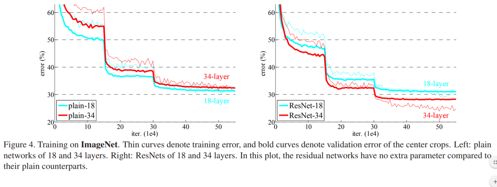
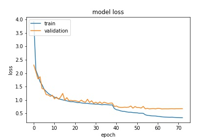

# Image Classification using keras-resnet

## Introducion
In the medical field, computer vision systems thoroughly examine imagery from MRIs, CAT scans and X-rays to detect abnormalities as accurately as human doctors. Medical professionals also use neural networks on three-dimensional images like ultrasounds to detect visual differences in heartbeats and more.In manufacturing, businesses use computer vision to identify product defects in real time. As the products are coming off the production line, a computer processes images or videos, and flags dozens of different types of defects — even on the smallest of products.
As computer vision improves, it can be used to perform automated general tagging of images. This may eventually mean that manual and inconsistent tagging is not needed, making image organisation on a large scale quicker and more accurate. This has profound implications when querying large sets of image. Eventually, when applied to video, the data available will be mind boggling, and how we access and archive imagery may fundamentally change. Brands watch social media for mention of their products and services yet text is only one part of what social media users post online – images and video are important as well. Companies like Ditto and gumgum provide applications which listen and recognise the use of brand logos to help managers discover feedback. 

Image classification is the task of classifying a given image into one of the pre-defined categories. Traditional pipeline for image classification involves two modules: feature extraction and classification. Feature extraction involves extracting a higher level of information from raw pixel values that can capture the distinction among the categories involved. This feature extraction is done in an unsupervised manner wherein the classes of the image have nothing to do with information extracted from pixels. 

### CIFAR-10 dataset
The original one batch data is (10000 x 3072) matrix expressed in numpy array. 
The number of columns, (10000), indicates the number of sample data. 
As stated in the CIFAR-10/CIFAR-100 dataset, the row vector, (3072) represents an color image of 32x32 pixels. 
Since this project is going to use CNN for the classification tasks, the original row vector is not appropriate. 
In order to feed an image data into a CNN model, the dimension of the input tensor should be either (width x height x num_channel) or (num_channel x width x height). 
It depends on your choice (check out the tensorflow conv2d). I am going to use the first choice because the default choice in tensorflow’s CNN operation is so.

##### original labels

The label data is just a list of 10,000 numbers ranging from 0 to 9, which corresponds to each of the 10 classes in CIFAR-10.

-    airplane : 0
-   automobile : 1
-   bird : 2
-   cat : 3
-   deer : 4
-   dog : 5
-   frog : 6
-   horse : 7
-   ship : 8
-   truck : 9

## Model Selection

Before residual nets were introduced convolutional neural networks were the latest and greatest of deep neural networks classification. In particular the top architectures were AlexNet was the most advanced deep neural network publically known starting in 2012. Yet, the main issue with AlexNet, and other deep neural networks, is the vanishing gradient. Degradation of a network occurs as depth increases causing accuracy to become saturated (which might be unsurprising). Unexpectedly, such degradation is not caused by overfitting, and adding more layers to a suitably deep model leads to higher training error. As per what we have seen so far, increasing the depth should increase the accuracy of the network, as long as over-fitting is taken care of. But the problem with increased depth is that the signal required to change the weights, which arises from the end of the network by comparing ground-truth and prediction becomes very small at the earlier layers, because of increased depth. It essentially means that earlier layers are almost negligible learned. This is called vanishing gradient. The second problem with training the deeper networks is, performing the optimization on huge parameter space and therefore naively adding the layers leading to higher training error. Residual networks allow training of such deep networks by constructing the network through modules called residual models as shown in the figure. This is called degradation problem. 

If input is `x`, then output after `n` layers is `H(x)`

Bringing in the residual concept in here:

There is a shortcut, hard wired connection from input to output, which is the input $x$ itself. The mapping learned by the layers is not `H(x)` anymore. It is `F(x)`. 

Once the shortcut and main path are joined, we get our original mapping $ H(x) $. Now, say, when the network needs to learn an identity mapping `H(x) = x`, it actually learns something else which is not identity.  

Since addition with the input will be resultant, though network couldn't learn anything, the output of a residual block will be,

We can see from the results (below) in the published article on residual networks that degradation of accuracy occurs in plain deep networks as depth increases yet deep residual networks increase with accuracy as depth increases. 

## Experiment

I performed classification on the cifar 10 dataset using a modestly deep neural network with several engineered parameters. First I normalized the dataset by splitting the images into RBG channels, subtracting the mean and dividing by 128. Then I randomly augmented the data to prevent overfitting and improve training. Then, I split the data into a training sample of 50000 and a test sample of 10000. After which I split the training data into forths for training and validation. The test data was saved for prediction. I also added an early stopping method to end training if the change in accuracy wasn't greater than 0.001 after 3 iteratations.

`Depth = 50`
`batch_size = 32`
`nb_epoch = 100`
`data_augmentation = True`

## Results

Below I present the results of a 50 layer deep residual network against the Cifar 10 dataset. 

### The original articles
 * [Deep Residual Learning for Image Recognition](http://arxiv.org/abs/1512.03385) (the 2015 ImageNet competition winner)
 * [Identity Mappings in Deep Residual Networks](http://arxiv.org/abs/1603.05027)

### Residual blocks
The residual blocks are based on the new improved scheme proposed in [Identity Mappings in Deep Residual Networks](http://arxiv.org/abs/1603.05027) as shown in figure (b)

